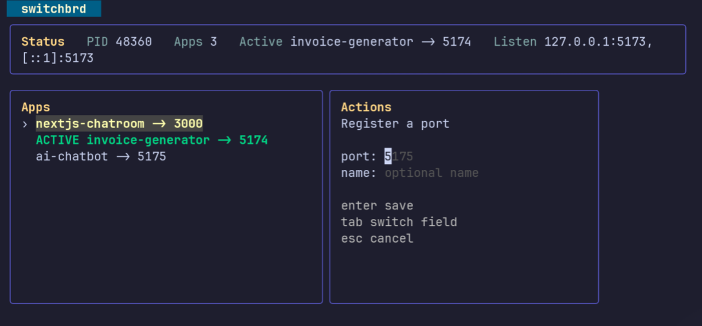

# switchbrd

`switchbrd` is a local development switchboard for running multiple apps in parallel while keeping a single stable URL.

It listens on `http://localhost:5173` by default and forwards that port to whichever registered app is currently active. That lets you keep two or more apps running on their own ports, such as `5174`, `5175`, and `5176`, while continuing to use the same browser tab, callback URL, and local origin during development.

Use it when you are developing several frontend apps at the same time and want to switch between them quickly without constantly changing ports.

## Install

### Requirements

- Go `1.26` or newer

### Native Go install

Clone the repository, then install the binary with the Go toolchain:

```sh
go install ./cmd/switchbrd
```

This installs `switchbrd` into your `GOBIN` or `$(go env GOPATH)/bin`. Make sure that directory is on your `PATH` if you want to run `switchbrd` directly.

If you do not want to install the binary yet, you can run it from the repository with:

```sh
go run ./cmd/switchbrd
```

## How It Works

Start the switchbrd server once, register the app ports you care about, and activate the app you want on the shared port.

Example flow:

```sh
switchbrd start
switchbrd add 5174 --name marketing-site
switchbrd add 5175 --name dashboard
switchbrd activate dashboard
```

After that, visiting `http://localhost:5173` resolves to the active app. Changing the active app updates the target without changing the browser URL.

## TUI

Running `go run ./cmd/switchbrd tui` opens the terminal UI for viewing registered apps, switching the active app, and managing ports.



## Usage

Running `switchbrd` with no command launches the terminal UI. Use `switchbrd --help` or `switchbrd -h` to print the built-in help message.

### Server lifecycle

Run one of the start commands below to launch the local switchbrd server. You only need to start it once. The port flag is optional and only needed if you do not want to use the default port `5173`.

```sh
switchbrd serve
switchbrd start
```

Optional custom port:

```sh
switchbrd serve --port 6000
switchbrd start --port 6000
```

Inspect or stop the running server:

```sh
switchbrd status
switchbrd stop
```

`serve` runs in the foreground. `start` runs the server in the background. `--port` or `-p` changes the shared proxy port from the default `5173`.

### Register and inspect apps

Use these commands to tell switchbrd which app ports exist:

```sh
switchbrd add 5174
switchbrd add 5175 --name my-app
switchbrd list
switchbrd rename 5175 my-app
switchbrd remove my-app
```

Registered apps are the possible targets for the shared port.

### Switch the active app

Use these commands to control which registered app currently receives traffic on the shared port:

```sh
switchbrd activate 5174
switchbrd activate my-app
switchbrd activate 5175 --name my-app
switchbrd active
```

`activate` accepts either a registered port or a registered name. `active` prints the current target.

### Terminal UI

Use the TUI when you want to manage everything interactively:

```sh
switchbrd
switchbrd tui
switchbrd tui -p 6000
```

The TUI can start the server if needed, show registered apps, highlight the active target, and handle add, rename, remove, and activate actions from one screen.
